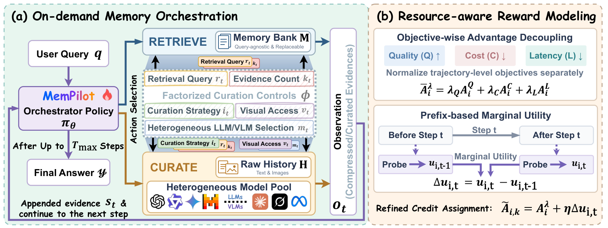

<p align="center">
  
</p>

<h1 align="center">MemPilot: Orchestrating On-Demand Multimodal Memory Curation for LLM Agents</h1>

<p align="center">
  <a href="https://viktoraxelsen.github.io/MemPilot/"></a>
  <a href="https://arxiv.org/abs/2610.06830"></a>
  <a href="https://hf.co/collections/XaiverZ/mempilot"></a>
  <br>
  <a href="https://github.com/ViktorAxelsen/MemPilot/stargazers"></a>
  <a href="https://github.com/ViktorAxelsen/MemPilot/forks"></a>
  <a href="https://github.com/ViktorAxelsen/MemPilot/issues"></a>
  <a href="LICENSE"></a>
</p>

<p align="center">
  <a href="#overview">Overview</a> ·
  <a href="#news">News</a> ·
  <a href="#installation">Installation</a> ·
  <a href="#configuration">Configuration</a> ·
  <a href="#preparing-data">Data Preparation</a>
  <br>
  <a href="#training">Training</a> ·
  <a href="#evaluation">Evaluation</a> ·
  <a href="#using-an-existing-memory-bank">Existing Memory Bank</a> ·
  <a href="#acknowledgments">Acknowledgments</a> ·
  <a href="#citation">Citation</a>
</p>

<a id="overview"></a>

## 🧠 Overview

**MemPilot** learns how to gather and process multimodal memory at query time.
A policy chooses what evidence to access, which LLM/VLM to use, when images are
needed, and when to stop gathering evidence and answer.

- **Two memory actions:** RETRIEVE accesses a query-agnostic memory bank; CURATE
  delegates query-specific curation of raw multimodal history to a selected LLM/VLM.
- **Resource-aware training:** Optimize answer quality, cost, and latency under
  chosen preferences, with marginal utility credit for memory-gathering stages.
- **Joint training and transfer evaluation:** Train on Mem-Gallery,
  WorldMemArena-Lifelong, and H2HMem (both dyadic and multiparty variants).
  Evaluate on their held-out test sets, with MemEye Open and MEMLENS 32K-Agent
  used exclusively for out-of-distribution evaluation.

<p align="center">
  <a href="docs/assets/figures/architecture.png">
    
  </a>
</p>

<a id="news"></a>

## 📰 News

- 🚀 **[2026-10-05]** We release **MemPilot**, a framework for on-demand multimodal
  memory curation. A learned orchestrator decides what evidence to gather and which
  LLM/VLM should process it, enabling controllable trade-offs among answer quality,
  cost, and latency.

<a id="installation"></a>

## 🚀 Installation

Run commands from the repository root. The environment uses **Python 3.12**.

```bash
bash scripts/setup_environment.sh --env-name mempilot
conda activate mempilot
```

For an existing Python 3.12 environment:

```bash
python -m pip install torch==2.8.0 torchvision==0.23.0 torchaudio==2.8.0 \
  --index-url https://download.pytorch.org/whl/cu128
python -m pip install -r requirements.txt
python -m pip install -r requirements-flash-attn.txt
python -m pip check
```

The setup uses VeRL 0.8.0, PyTorch 2.8 and vLLM 0.11.0. The supplied FlashAttention
wheel is for Python 3.12 and PyTorch 2.8 on Linux x86_64.

<a id="configuration"></a>

## ⚙️ Configuration

Edit training settings in [`scripts/train.sh`](scripts/train.sh) and evaluation
settings in [`scripts/eval_common.sh`](scripts/eval_common.sh). Set credentials
in the environment, or uncomment and fill in the `export` examples in those scripts:

```bash
export OPENROUTER_API_KEY="your_openrouter_api_key"
export OPENROUTER_BASE_URL="https://openrouter.ai/api/v1"
export HUGGING_FACE_HUB_TOKEN="your_hugging_face_token"
export WANDB_API_KEY="your_wandb_api_key"
```

Script exports override environment values. For benchmark evaluation, the answer
model and judge can use separate `ANSWER_API_KEY` / `ANSWER_BASE_URL` and `JUDGE_API_KEY` /
`JUDGE_BASE_URL` settings. Their Python CLIs also accept OpenAI-compatible
`OPENAI_API_KEY` / `OPENAI_BASE_URL` settings.

Configure the CURATE model pool and resource profiles in
[`configs/runtime_memory_tool.yaml`](configs/runtime_memory_tool.yaml).

<a id="preparing-data"></a>

## 📦 Preparing data

The commands below download the required source files from the linked Hugging Face
datasets and convert them into Parquet files for training and evaluation. To use
an existing local download, add `--dataset_dir /path/to/dataset` and preserve the
original dataset directory layout. Each converter supports `--help`.

All five converters accept `--hf_download_rps` (default: **1.0 request per second**)
to limit Hub HTTP requests for dataset and model downloads during preprocessing.
Download threads within the same process share this limit. Use a positive value;
for example, `0.5` allows one request every two seconds:

```bash
python -m data.prepare_mem_gallery_verl \
  --output_dir data/mem_gallery --hf_download_rps 0.5
```

On HTTP 429, downloads wait according to the server's rate-limit headers and retry
up to **5 times**. Existing downloaded files are reused from the Hugging Face cache.
When running multiple preprocessing processes, lower the rate for each process.

The default leaves room below the
[published anonymous request limits](https://huggingface.co/docs/hub/rate-limits).
A paid Hugging Face subscription is not required; authenticating with a free
account provides a higher quota.

**Training and in-domain evaluation** use Mem-Gallery, WorldMemArena-Lifelong,
and both H2HMem variants. Each source is split independently by conversation,
with target train/validation/test ratios of **70/10/20** and `--seed 13` by default.
All questions sharing a conversation history remain in the same split.
**MemEye and MEMLENS are used exclusively for out-of-distribution
evaluation**, with no contribution to training or model selection.

### 1) Mem-Gallery

[GitHub](https://github.com/YuanchenBei/Mem-Gallery) · [Dataset](https://huggingface.co/datasets/Ethan-Bei/Mem-Gallery)

Mem-Gallery evaluates memory over multimodal, multi-session conversations.
The default preprocessing excludes answer-refusal (`AR`) questions and splits
the remaining examples by conversation.

```bash
python -m data.prepare_mem_gallery_verl --output_dir data/mem_gallery
```

Output: `train.parquet`, `val.parquet`, and `test.parquet` under `data/mem_gallery/`.

### 2) WorldMemArena

[GitHub](https://github.com/UCSB-AI/WorldMemArena) · [Dataset](https://huggingface.co/datasets/LCZZZZ/WorldMemArena)

We use the **Lifelong Evolution** regime. Conversation histories are split with
stratification by category and scenario. Each question receives only the cumulative
history visible at its checkpoint.

```bash
python -m data.prepare_worldmemarena_verl \
  --regime lifelong --output_dir data/worldmemarena_lifelong
```

Output: `train.parquet`, `val.parquet`, and `test.parquet` under
`data/worldmemarena_lifelong/`.

### 3) H2HMem

[GitHub](https://github.com/varib1/H2HMEM) · [Dataset](https://huggingface.co/datasets/varib/H2HMEM)

We use **both dyadic and multiparty interactions**, prepared and split separately.
The default preprocessing excludes answer-refusal questions, dialogues with missing
required session content, and Conflict Detection examples whose reference answer is not a
standalone Yes/No label.

```bash
python -m data.prepare_h2hmem_verl \
  --variant dyadic --output_dir data/h2hmem_dyadic
python -m data.prepare_h2hmem_verl \
  --variant multiparty --output_dir data/h2hmem_multiparty
```

Output: `train.parquet`, `val.parquet`, and `test.parquet` in each of
`data/h2hmem_dyadic/` and `data/h2hmem_multiparty/`. Both directories are included
in the joint training command below; the [evaluation instructions](#evaluation)
also combine both test sets.

### 4) MemEye

[GitHub](https://github.com/MinghoKwok/MemEye) · [Dataset](https://huggingface.co/datasets/MemEyeBench/MemEye)

Our out-of-distribution evaluation uses the **open-answer variant: 371 questions
across eight scenarios**. The converter exports both open-answer and multiple-choice
data; use the open-answer output to reproduce the paper's setting.

```bash
python -m data.prepare_memeye_verl --output_dir data/memeye
```

Evaluation file: `data/memeye/open/test.parquet`. The additional MCQ output is
written to `data/memeye/mcq/test.parquet`.

### 5) MEMLENS

[GitHub](https://github.com/xrenaf/MEMLENS) · [Dataset](https://huggingface.co/datasets/xiyuRenBill/MEMLENS)

Our out-of-distribution evaluation uses the **32K memory-agent subset**. The
official subset contains 195 questions; default preprocessing removes its 22
answer-refusal questions, leaving **173 evaluation questions**.

```bash
python -m data.prepare_memlens_verl \
  --context_length 32k --evaluation_subset agent --output_dir data/memlens_32k_agent
```

Evaluation file: `data/memlens_32k_agent/test.parquet`. For a local download,
`--dataset_dir` should contain `dataset_32k.json`, `agent_subset_195.json`, and
the `release_images/` directory.

### Merge the training sources

After preparing the first three benchmarks, merge their four source directories:

```bash
python -m data.merge_multimodal_verl \
  --input_dir data/mem_gallery \
  --input_dir data/worldmemarena_lifelong \
  --input_dir data/h2hmem_dyadic \
  --input_dir data/h2hmem_multiparty \
  --output_dir data/multimodal_unified
```

The merger preserves each source's existing splits and `data_source` labels,
checks for conversation leakage, and writes all three Parquet splits plus a
`manifest.json` with per-source counts. Training uses the merged `train.parquet`
and `val.parquet`; benchmark evaluation uses the source test sets described in
[Evaluation](#evaluation).

<a id="training"></a>

## 🏋️ Training

Training optimizes the **orchestrator policy**, which defaults to
`Qwen/Qwen3-4B-Instruct-2507`. The policy learns to select memory actions and
delegate curation to the LLM/VLM pool configured in
[`configs/runtime_memory_tool.yaml`](configs/runtime_memory_tool.yaml).

### Configure a run

Review the settings at the top of [`scripts/train.sh`](scripts/train.sh).
The main defaults are:

| Setting | Default | Purpose |
| --- | --- | --- |
| `DATA_DIR` | `data/multimodal_unified` | Merged training and validation files |
| `MODEL_PATH` | `Qwen/Qwen3-4B-Instruct-2507` | Initial orchestrator model |
| `CUDA_VISIBLE_DEVICES` / `NGPUS_PER_NODE` | `0,1,2,3` / `4` | Devices used for training |
| `TRAIN_BATCH_SIZE` / `ROLLOUT_N` | `32` / `4` | Queries per batch and rollouts per query |
| `LEARNING_RATE` / `TOTAL_EPOCHS` | `1e-6` / `3` | Optimization schedule |
| `MAX_TURNS` / `MAX_PARALLEL_CALLS` | `6` / `2` | Maximum turns and parallel operations |
| `DYNAMIC_RETRIEVAL_TOP_K` | `5` | Maximum evidence items per operation |
| `MARGINAL_UTILITY_WEIGHT` | `0.5` | Contribution of stage-level marginal utility |
| `COST_ADVANTAGE_WEIGHT` / `LATENCY_ADVANTAGE_WEIGHT` | `0.0` / `0.0` | Cost and latency preferences |

Training reads `train.parquet` and uses `val.parquet` for periodic validation and
model selection. Prepare both files with the [data preparation steps](#preparing-data),
and set the provider credentials described in [Configuration](#configuration).

### Launch training

```bash
bash scripts/train.sh
```

`DATA_DIR` can be supplied through the environment. The other shell variables
listed above are assigned in the script and can be edited there. For options
exposed by VeRL/Hydra, command-line overrides are applied after the script defaults.

For example, use a different prepared directory and train for five epochs:

```bash
DATA_DIR=/path/to/prepared_data bash scripts/train.sh trainer.total_epochs=5
```

### Set resource preferences

Use non-negative cost and latency weights to balance answer quality and resource
use. A weight of `0` disables the corresponding resource objective.

For an example custom preference with both weights set to `0.1`:

```bash
bash scripts/train.sh \
  algorithm.gdpo.cost_weight=0.1 \
  algorithm.gdpo.latency_weight=0.1
```

The launcher records these weights in the run name. Select preference weights
using the validation sets when exploring quality, cost, and latency trade-offs.

### Checkpoints and logs

Validation runs before training. By default, validation and checkpoint saving
then run every half epoch, controlled by `VALIDATION_INTERVAL_EPOCHS` and
`CHECKPOINT_INTERVAL_EPOCHS`.

- **Checkpoints:** `checkpoints/mempilot/<run_name>/global_step_<step>/`.
- **Console log:** `logs/<run_name>.log`.
- **Model-call log:** `logs/<run_name>.pid<pid>.model_calls.log`.

The default logger writes to the console and W&B. For console-only logging,
append `trainer.logger='["console"]'` to the training command.

<a id="evaluation"></a>

## 🧪 Evaluation

We evaluate answer quality, cost, and latency on the five benchmarks, reporting
F1 and benchmark-specific LLM-judge scores.

In normal use, MemPilot's policy model directly generates the final answer,
with no separate answer model required. For fair comparison with baselines,
the scripts below use the same answer model across methods to generate answers
from each method's gathered evidence (answer replacement).

### Configure models and test data

Edit [`scripts/eval_common.sh`](scripts/eval_common.sh), or export its variables
before launching. The defaults for this evaluation setup are:

| Role | Settings | Default |
| --- | --- | --- |
| Policy model | `MODEL_PATH`, `EVAL_CUDA_VISIBLE_DEVICES` | `Qwen/Qwen3-4B-Instruct-2507`, devices `0,1,2,3` |
| Answer model (comparison only) | `ANSWER_BACKEND`, `ANSWER_MODEL`, `ANSWER_CUDA_VISIBLE_DEVICES` | Local `vllm`, `Qwen/Qwen3-VL-4B-Instruct`, device `0` |
| Judge | `JUDGE_MODEL`, `JUDGE_BASE_URL` | `openai/gpt-4o-mini` through OpenRouter |

For VeRL training checkpoints, `MODEL_PATH` must match the model used to train
the checkpoint. Pass its `global_step_<step>` directory to `--checkpoint-path`.
Use the shared provider credentials from [Configuration](#configuration), or set
`ANSWER_API_KEY` and `JUDGE_API_KEY` for separate answer and judge services.

For H2HMem, merge the two prepared variants and select their combined test split:

```bash
python -m data.merge_multimodal_verl \
  --input_dir data/h2hmem_dyadic \
  --input_dir data/h2hmem_multiparty \
  --output_dir data/h2hmem

export H2HMEM_TEST_FILE="$PWD/data/h2hmem/test.parquet"
```

This export replaces the launcher's `h2hmem_dyadic/test.parquet` default with
the combined dyadic and multiparty test set.

The following test files are used after data preparation and the H2HMem export
above. Paths are relative to `data/`; each can be overridden independently.

| Dataset selection | Prepared test file | Path override |
| --- | --- | --- |
| `mem_gallery` | `mem_gallery/test.parquet` | `MEM_GALLERY_TEST_FILE` |
| `worldmemarena` | `worldmemarena_lifelong/test.parquet` | `WORLDMEMARENA_TEST_FILE` |
| `h2hmem` | `h2hmem/test.parquet` | `H2HMEM_TEST_FILE` |
| `memeye` | `memeye/open/test.parquet` | `MEMEYE_TEST_FILE` |
| `memlens` | `memlens_32k_agent/test.parquet` | `MEMLENS_TEST_FILE` |

### Run evaluation

Run the benchmark comparison protocol across all five datasets:

```bash
bash scripts/eval.sh \
  --checkpoint-path /path/to/global_step_100 \
  --output-dir eval_outputs/run1
```

Add `--datasets mem_gallery memeye` to evaluate a subset. All evaluation entry
points accept `--help`, `--output-dir`, and `--datasets`; policy inference and
the full evaluation script also require the checkpoint path.

> [!NOTE]
> The `perf-first/`, `balanced/`, and `cost-first/` folders on the
> [`main` branch of XaiverZ/MemPilot-4B](https://huggingface.co/XaiverZ/MemPilot-4B/tree/main)
> contain **merged, standard Hugging Face models**. Load the downloaded folder
> directly.
>
> For these models, in the `python3 -m trainers.main_ppo_sync` command in
> [`scripts/eval_policy.sh`](scripts/eval_policy.sh), keep
> `actor_rollout_ref.model.path="$MODEL_PATH"` and change the two existing resume
> arguments to `trainer.resume_mode=disable` and `trainer.resume_from_path=null`.
> Then run, replacing the path with your downloaded model folder:
>
> ```bash
> export MODEL_PATH=/path/to/perf-first
> bash scripts/eval.sh \
>   --checkpoint-path "$MODEL_PATH" \
>   --output-dir eval_outputs/perf_first
> ```
>
> The launcher still requires `--checkpoint-path`; passing the same model folder
> satisfies its directory check while checkpoint resuming is disabled.

For comparisons using Qwen3.5-9B through an API:

```bash
ANSWER_BACKEND=openai ANSWER_MODEL=qwen/qwen3.5-9b \
bash scripts/eval.sh \
  --checkpoint-path /path/to/global_step_100 \
  --output-dir eval_outputs/qwen35_9b
```

`ANSWER_BASE_URL` selects the answer endpoint. For another answer model, add a
matching entry with pricing and latency coefficients to
`resource_accounting.model_profiles` in
[`configs/runtime_memory_tool.yaml`](configs/runtime_memory_tool.yaml).

### Run or restart individual stages

For debugging or resuming evaluation, run the stages separately with the same
output directory and dataset selection:

```bash
bash scripts/eval_policy.sh --checkpoint-path /path/to/global_step_100 \
  --output-dir eval_outputs/run2 --datasets mem_gallery memeye
bash scripts/eval_answer_replacement.sh \
  --output-dir eval_outputs/run2 --datasets mem_gallery memeye
bash scripts/eval_metrics.sh \
  --output-dir eval_outputs/run2 --datasets mem_gallery memeye
```

If answer generation or scoring is interrupted, rerun that stage with the same
inputs and settings to reuse completed entries in its progress cache. Policy
inference requires a fresh dataset output directory, so use a new `--output-dir`
when restarting it or evaluating another checkpoint.

### Read the results

Each benchmark has its own directory under `eval_outputs/<run>/<dataset>/`:

| Output | Contents |
| --- | --- |
| `policy/*.jsonl` | Saved policy trajectories and gathered evidence |
| `answer_replacement/raw_responses.jsonl` | Answers from the shared evaluation model and generation metadata |
| `metrics/report.txt` | Human-readable metric summary |
| `metrics/metrics.json` | Aggregate results by dataset and question type |
| `metrics/evaluated_responses.jsonl` | Per-question predictions, references, and judge results |
| `metrics/manifest.json` | Input files, resource-profile configuration, and evaluation metadata |
| `logs/` | Logs for each evaluation stage |

F1 and LLM-judge scores are averaged over questions. QA cost is summed over
questions and divided by the number of unique `(dataset_source, conversation_id)`
pairs; latency estimates are averaged per question. The evaluator groups both
H2HMem variants under `h2hmem` while preserving their source identities for counting.

> **Resource accounting:** For benchmark comparisons, the replacement model is
> treated as the policy model when computing cost and latency. Its pricing and
> latency profile is applied to the saved policy trajectory, then combined with
> routed-model costs and per-stage latency, taking the maximum for parallel
> operations. Judge usage is excluded, and offline memory-bank construction cost
> is not recorded. See
> [`evaluation/finalize_artifacts.py`](evaluation/finalize_artifacts.py) for details.

<a id="using-an-existing-memory-bank"></a>

## 🔌 Using an existing memory bank

MemPilot can use text memories exported by another agent memory system. The
[memory adapter](data/convert_memory_bank.py) converts those exports into
RETRIEVE's memory corpus and rebuilds its retrieval index. CURATE continues to
access the original multimodal history stored in the prepared data.

### Export memories by conversation

Provide a **JSON array of records**, or a **JSONL file with one record per line**.
Each record contains one sample/conversation's memory bank, shared by all its
questions. The adapter matches records by `(data_source, conversation_id)`:

```json
[
  {
    "data_source": "mem_gallery",
    "conversation_id": "conversation-1",
    "memories": [
      {"id": "fact-1", "text": "Alice visited Rome."}
    ]
  }
]
```

- Copy `data_source` from the prepared row and `conversation_id` from its
  `extra_info`; the values above are illustrative. `question_id` is not used
  for memory-bank matching.
- `memories` accepts strings or records with `id` and `text`. Text must be
  non-empty, and IDs must be unique within each bank. `[]` explicitly represents
  an empty bank.

For histories that change across checkpoints, also include the `checkpoint_id`
from the prepared row's `extra_info`. Export one bank per
`(data_source, conversation_id, checkpoint_id)`, containing only history available
at that checkpoint. All questions at the same checkpoint share the bank, and the
adapter requires an exact checkpoint match. For histories without checkpoints,
omit `checkpoint_id` or set it to `null`.

Provide one record for every conversation or conversation checkpoint represented
in the input directory's Parquet splits. The adapter checks coverage and rejects
duplicate records for the same conversation/checkpoint before writing output.

For different field names, use `--items_field`, `--text_field`, and `--id_field`.
For richer exports, customize `convert_memory_items` in
[`data/convert_memory_bank.py`](data/convert_memory_bank.py) to flatten relevant
content into text records.

### Train with an adapted bank

For joint training, convert the merged data and select its output directory:

```bash
python -m data.convert_memory_bank \
  --input_dir data/multimodal_unified \
  --memory_file /path/to/external_memory.jsonl \
  --output_dir data/multimodal_external

DATA_DIR=data/multimodal_external bash scripts/train.sh
```

Use a separate output directory without existing Parquet splits. Conversion
preserves raw history, images, questions, reference answers, and split assignments.
The adapter's retriever must match the prepared raw-history index and runtime
configuration; the default is `Qwen/Qwen3-Embedding-0.6B`.

### Evaluate with an existing policy

To evaluate another bank with a trained policy, adapt the benchmark's prepared
directory and point its test-file variable at the converted output. For example,
MemEye Open has a test-only directory:

```bash
python -m data.convert_memory_bank \
  --input_dir data/memeye/open \
  --memory_file /path/to/memeye_memory.jsonl \
  --output_dir data/memeye_external

MEMEYE_TEST_FILE="$PWD/data/memeye_external/test.parquet" \
bash scripts/eval.sh \
  --checkpoint-path /path/to/global_step_100 \
  --output-dir eval_outputs/memeye_external \
  --datasets memeye
```

The same checkpoint can be used for this memory-bank compatibility evaluation.
For other benchmarks, use the corresponding test-file override listed in
[Evaluation](#evaluation).

<a id="acknowledgments"></a>

## 🙏 Acknowledgments

MemPilot builds on **[VeRL](https://github.com/verl-project/verl)** for reinforcement
learning. We thank its authors and maintainers for making the training framework
available to the research community.

We also thank the teams behind
**[Mem-Gallery](https://github.com/YuanchenBei/Mem-Gallery)**,
**[WorldMemArena](https://github.com/UCSB-AI/WorldMemArena)**,
**[H2HMem](https://github.com/varib1/H2HMEM)**,
**[MemEye](https://github.com/MinghoKwok/MemEye)**, and
**[MEMLENS](https://github.com/xrenaf/MEMLENS)** for releasing their datasets,
evaluation protocols, and supporting code. These resources enable the training,
comparison, and transfer evaluation of multimodal agent memory systems.

<a id="citation"></a>

## 📚 Citation

If you use MemPilot in your research or build on this codebase, please cite the
[paper](https://arxiv.org/abs/2610.06830):

```bibtex
@article{zhang2026mempilot,
  title={MemPilot: Orchestrating On-Demand Multimodal Memory Curation for LLM Agents},
  author={Zhang, Haozhen and Yue, Haodong and Long, Quanyu and Bao, Jianzhu and Liu, Qingyuan and Feng, Tao and Liu, Bohan and Liang, Weida and Wang, Wenya},
  journal={arXiv preprint arXiv:2610.06830},
  year={2026}
}
```
